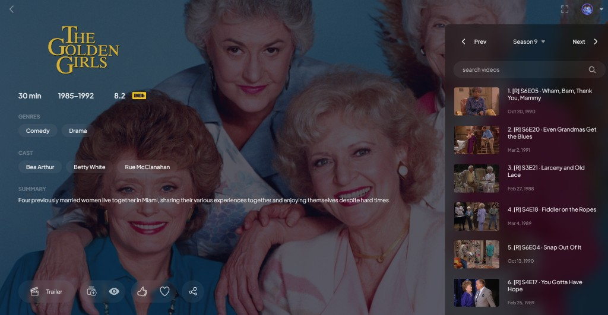

# Stremio Randomizer

For when you want the magic of endless reruns of your favorite comfort TV show on Stremio.

This addon adds a **Randomizer** season to every TV show.  
The randomized season is always the very last one — for example, if a show has 8 seasons, Randomizer is Season 9.



## What you get

**No more decision fatigue.** Open a show you love, hit play, and let it carry you — no scrolling, no picking, no “what episode tonight?”

- A shuffled season ready whenever you want background comfort or a proper binge
- Auto plays next episode
- Reshuffle anytime from the addon settings when you want a fresh mix

## Install

https://simonelmundo.github.io/stremio-randomizer/

**Before you install:** remove / disable every other TV show metadata source — for example official Cinemeta, AIOMetadata, TMDB/Trakt meta addons, anime meta addons, and anything else that provides series metadata. Randomizer needs to be your only meta addon so Stremio uses it.

This build uses **Cinemeta** under the hood for catalogs and show info. Future versions may include other metadata sources.

### Streams (Randomizer season)

Uses **Cinemeta** for TV show metadata. Randomizer streams use the built-in default public **Torrentio** configuration for stream lookup (not your installed Torrentio/debrid addons). Normal seasons still use whatever stream addons you have.

Direct manifest:  
`https://06a6d06388d0-stremio-randomizer.baby-beamup.club/manifest.json`

## Local (optional)

```bash
npm start
```
